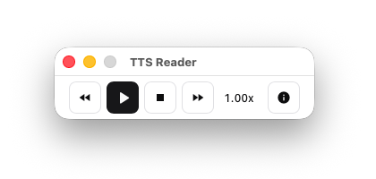

# TTS Reader

A lightweight TTS player that speaks text aloud using Kokoro's 82M-param voice model.



## Features

- **Kokoro TTS Engine** - Open-weight neural TTS model (82M params) for natural-sounding speech
- **28 English Voices** - American/British, male/female, selectable at runtime
- **Clipboard Monitoring** - Automatically detects when you copy text
- **Global Shortcut** - Press `Cmd+Shift+R` to play/pause from anywhere
- **Speed Control** - Adjustable speech rate (0.5x to 2.0x)
- **Voice Selection** - Choose from 28 voices in the dropdown below controls
- **Self-Contained** - Model and voices embedded in the binary, no external files needed
- **Minimal UI** - Tiny floating player that doesn't get in the way


**Note**: application only works for macOS and Linux, future support for Windows is planned.

## Download

Download the latest release:

[TTS Reader.dmg](https://organizer.lamart.ge/downloads/TtsReader-v0.0.3.dmg)

[TTS Reader.deb](https://organizer.lamart.ge/downloads/TtsReader-v0.0.3.deb)

Just open the `.dmg` file and drag the app to your Applications folder.

## How to Use

1. **Copy text** anywhere on your Mac (select text + `Cmd+C`)
2. **Click Play** or press `Cmd+Shift+R` to start listening
3. **Adjust speed** with the `<<` and `>>` buttons
4. **Select Voice** - Choose from 28 voices in the dropdown below the controls
5. **Click Stop** to stop playback

## Building from Source

### Prerequisites

- macOS 12.0 or later
- Rust (install via [rustup](https://rustup.rs/))
- Dioxus CLI

```bash
cargo install dioxus-cli
```

### Development

```bash
# Clone the repository
git clone https://github.com/yourusername/tts-reader.git
cd tts-reader

# Run in development mode
cargo run -p tts-reader
# Or
cd packages/desktop && cargo run
```

### Production Build

```bash
# Build release binary (includes embedded model, ~310MB)
cargo build --release

# Or create a .app bundle
dx bundle --platform macos --package-types app

# Or create a .dmg installer
dx bundle --platform macos --package-types dmg
```

## Tech Stack

- [Dioxus 0.7](https://dioxuslabs.com/) - Cross-platform UI framework
- [Tokio](https://tokio.rs/) - Async runtime
- [Kokoro TTS](https://github.com/hexgrad/kokoro) - Open-weight neural TTS model
- [ort](https://github.com/pykeio/ort) - ONNX Runtime for model inference
- [rodio](https://github.com/RustAudio/rodio) - Audio playback
- macOS `say` command - Fallback TTS
- `pbpaste` - Clipboard monitoring

## Voice Configuration

The default voice can be configured via a `.env` file in the project root:

```env
KOKORO_VOICE=af_heart                    # Default voice (American Female)
# KOKORO_MODEL_DIR=/path/to/models       # Optional: override model path
# KOKORO_VOICE_DIR=/path/to/voices       # Optional: override voice dir
```

Available voices:
- **American Female**: Heart, Alloy, Aoede, Bella, Jessica, Kore, Nicole, Nova, River, Sarah, Sky
- **American Male**: Adam, Echo, Eric, Fenrir, Liam, Michael, Onyx, Puck, Santa
- **British Female**: Alice, Emma, Isabella, Lily
- **British Male**: Daniel, Fable, George, Lewis

## Voice Samples

Listen to all 28 voice samples on the [Kokoro-82M-v1.0-ONNX HuggingFace page](https://huggingface.co/onnx-community/Kokoro-82M-v1.0-ONNX).


## License

MIT
